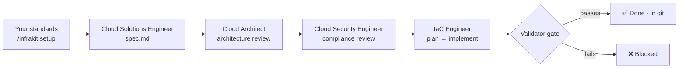

<div align="center">
  
  <h1>InfraKit</h1>
  <h3><em>Spec it. Plan it. Ship it.</em></h3>
</div>

<p align="center">
  <strong>Spec-driven infrastructure-as-code for AI coding agents.</strong><br/>
  Capture your standards once — naming, tagging, security baselines, compliance scope — and every
  Terraform module, Crossplane composition, or CloudFormation template your agent writes matches them.
  Field names verified against provider docs. Architecture and security reviewed before code.
  The whole audit trail in git.
</p>

<p align="center">
  <a href="https://pypi.org/project/infrakit-cli/"></a>
  <a href="https://pypi.org/project/infrakit-cli/"></a>
  <a href="https://github.com/neelneelpurk/infrakit/actions/workflows/release.yml"></a>
  <a href="https://github.com/neelneelpurk/infrakit/blob/main/LICENSE"></a>
  <a href="https://github.com/neelneelpurk/infrakit/stargazers"></a>
</p>

<p align="center">
  <a href="#quickstart">Quickstart</a> ·
  <a href="#command-reference">Commands</a> ·
  <a href="#supported-ai-coding-agents">Agents</a> ·
  <a href="#supported-iac-platforms">IaC platforms</a> ·
  <a href="#examples">Examples</a> ·
  <a href="./docs/">Docs</a>
</p>

---

## Why InfraKit

AI writes Terraform in seconds — and that turned out to be the problem. Hand
infrastructure to coding agents with no shared standard and you get drift: ask
three engineers for "an S3 bucket" and you get three incompatible modules —
different tags, different layout, one with public access left open. They all
"work." None of them match. And the quickest way to lose a team's trust is a
hallucinated argument name that sails past `plan` and dies at `apply`.

InfraKit is **[spec-kit](https://github.com/github/spec-kit) for
infrastructure-as-code** with a fix for exactly that. It keeps spec-kit's shape
— capture intent first, then plan, then implement, every artifact in git — and
adds the two things IaC actually needs: **constraints captured up front and
enforced as hard gates**, and **a four-persona pipeline** that gives
architecture, security, and implementation each a dedicated pass.

<div align="center">
  
</div>

## What you get

- **Constraint-driven development.** `/infrakit:setup` captures your cloud
  provider, naming, tagging, per-environment security baselines, and compliance
  scope into `.infrakit/` *before* a line of resource code is written. Every
  downstream command reads them, so "make me a database" returns *your* database
  — same naming, same tags, same posture — no matter who runs it.
- **Provider-verified field names.** The IaC Engineer reads the provider's own
  docs (`registry.terraform.io` / `doc.crds.dev` / the AWS resource-type
  reference) before writing each field. Never guessing argument names is the
  project's core trust claim.
- **Validation as a hard gate.** `/infrakit:implement` won't mark a track done
  until the tool's validator passes (`tofu validate` / `cfn-lint` /
  `crossplane render`). If it can't run, the track is **blocked**, not done.
- **A full audit trail in git.** Spec, plan, task list, per-persona reviews, and
  changelog land alongside the code — every design decision and compliance
  waiver traces back to a human approval.
- **Three IaC tools, five agents, zero network calls.** Terraform, Crossplane,
  and CloudFormation out of the box; Claude Code, Codex, Gemini, Copilot, or any
  generic agent. Templates ship inside the wheel — `infrakit init` runs entirely
  offline.

## How it works

Four personas, one job each — so one model wearing four hats doesn't try to
balance requirements, architecture, security, and implementation all at once.



- **Cloud Solutions Engineer** — turns intent into a structured `spec.md`, one
  clarifying question at a time.
- **Cloud Architect** — reviews the spec for reliability, cost, completeness, and
  environment-fit, returning severity-tagged findings and a verdict. It judges;
  it doesn't write code.
- **Cloud Security Engineer** — audits the spec against the frameworks you scoped
  (SOC 2, HIPAA, ISO 27001, PCI-DSS, NIST 800-53, CIS, FedRAMP) *before any code
  is written*.
- **IaC Engineer** — generates Crossplane YAML, Terraform HCL, or a
  CloudFormation template, verifying every field against the provider's own docs
  before writing it, then gating on the validator.

> [!TIP]
> **In a hurry?** The lighter **`/infrakit:quick_fix`** path skips the
> multi-persona ceremony: the IaC Engineer plans your requirement, generates a
> task list, shows you the plan to approve, then implements — still verifying
> field names, applying required tags, and gating on validation.

*A note on compliance:* the security review is a heuristic LLM pass that flags
common control violations against named frameworks. It is **not** a substitute
for a real audit by qualified humans with evidence collection. Use it as a
first-pass guardrail, not as your compliance system of record.

## Quickstart

### 1. Install the CLI

> [!NOTE]
> The commands below use **[uv](https://docs.astral.sh/uv/)**, a fast Python
> package manager. If you see `command not found: uv`,
> [install uv first](https://docs.astral.sh/uv/getting-started/installation/).
> The `pipx` alternative does not require uv.

```bash
# Persistent install (recommended) — latest release from PyPI
uv tool install infrakit-cli

# Alternative: pipx
pipx install infrakit-cli

# One-off, no install
uvx infrakit-cli init my-infra --ai claude --iac terraform
```

```bash
infrakit version   # verify the install
```

### 2. Initialize a project

```bash
infrakit init my-infra --ai claude --iac terraform   # new directory
infrakit init --here --ai claude --iac crossplane    # current directory
```

In interactive sessions you'll be prompted for the AI agent and IaC tool; in CI,
pass `--ai` and `--iac` explicitly. Prompts, personas, and templates render
**on your machine, offline** — no GitHub tokens, no per-agent release zips.

### 3. Run the workflow

Launch your AI coding agent in the project directory and drive it with the
`/infrakit:` slash commands:

```text
/infrakit:setup AWS multi-account platform; SOC 2 + PCI-DSS in scope;
encryption at rest mandatory; no public network access in prod
```

| Step | Command | What happens |
|------|---------|--------------|
| **Set standards** | `/infrakit:setup` | Captures context, coding-style, and tagging into `.infrakit/` |
| **Specify** | `/infrakit:create_terraform_code …` | Solutions → Architect → Security → confirmed `spec.md` |
| **Plan** | `/infrakit:plan <track>` | Verifies provider fields, writes `plan.md`, auto-generates `tasks.md` |
| **Implement** | `/infrakit:implement <track>` | Works through `tasks.md`, writes code + context/changelog/README, gates on the validator |
| **Review** | `/infrakit:review <dir>` | Audits the code against your coding-style and tagging standards |

Example spec prompts for each tool:

```text
# Terraform
/infrakit:create_terraform_code An AWS S3 bucket module. KMS encryption with a
customer-managed key, all four block_public_* flags set, TLS-only via bucket
policy, lifecycle on non-current versions, optional cross-region replication
gated to prod.

# Crossplane
/infrakit:new_composition A PostgreSQL Crossplane composition wrapping AWS RDS.
Multi-AZ in prod, per-instance customer-managed KMS key, no public access ever,
connection details published to a Kubernetes Secret in the claimer's namespace.

# CloudFormation
/infrakit:create_cloudformation_code An RDS PostgreSQL template. StorageEncrypted
with a customer-managed KMS key, PubliclyAccessible false always, Multi-AZ in
prod via a Condition, master password as a NoEcho parameter from Secrets Manager.
```

For the full step-by-step with every artifact explained, see
[the detailed walkthrough](#detailed-walkthrough) below or
[`examples/`](./examples/).

## Supported AI coding agents

InfraKit installs slash commands (or skills, via `--ai-skills`) into any of these
five agents:

| Agent | Flag | Subagents | Notes |
|-------|------|-----------|-------|
| [Claude Code](https://www.anthropic.com/claude-code) | `--ai claude` | ✅ Yes | Recommended — uses the `Task` tool to isolate persona review phases |
| [Codex CLI](https://github.com/openai/codex) | `--ai codex` | — | |
| [Gemini CLI](https://github.com/google-gemini/gemini-cli) | `--ai gemini` | — | Commands rendered as TOML |
| [GitHub Copilot](https://github.com/features/copilot) | `--ai copilot` | — | Auto-emits prompt + agent file pair; configures VS Code settings |
| Generic — bring your own | `--ai generic` | — | Use with `--ai-commands-dir <path>` |

With native subagents (Claude Code's `Task` tool), the Architect and Security
review phases run in isolated context windows — the architect's reasoning never
sees the security review's, and vice versa. On agents without subagents, the same
review prompts run inline; the boundaries are explicit but not enforced.

## Supported IaC platforms

| Platform | Status | Output | Resource Term |
|----------|--------|--------|---------------|
| [Crossplane](https://crossplane.io/) | ✅ Supported | YAML | Composition |
| [Terraform](https://www.terraform.io/) | ✅ Supported | HCL | Module |
| [AWS CloudFormation](https://docs.aws.amazon.com/cloudformation/) | ✅ Supported | YAML | Template |
| [OpenTofu](https://opentofu.org/) | 🗺️ Roadmap | — | — |
| [Pulumi](https://www.pulumi.com/) | 🗺️ Roadmap | — | — |

## Command reference

After `infrakit init`, your agent has these slash commands, prefixed
`/infrakit:`. With `--ai-skills`, the same commands install as agent skills.

### Core

| Command | Description |
|---------|-------------|
| `/infrakit:setup` | Capture project context, coding standards, and tagging requirements |
| `/infrakit:setup-coding-style` | Update or replace project coding-style standards |
| `/infrakit:new_composition` | (Crossplane) Solutions → Architect → Security → spec for a new XR/Composition |
| `/infrakit:create_terraform_code` | (Terraform) Solutions → Architect → Security → spec for a new module |
| `/infrakit:create_cloudformation_code` | (CloudFormation) Solutions → Architect → Security → spec for a new template |
| `/infrakit:plan` | Generate the implementation plan and auto-generate `tasks.md` |
| `/infrakit:implement` | Execute `tasks.md`, mark complete, write context / changelog / README |
| `/infrakit:review` | Review generated code against coding standards and tagging |
| `/infrakit:quick_fix` | Lighter path: requirement → plan → tasks → your review → implement |

### Brownfield

| Command | Description |
|---------|-------------|
| `/infrakit:update_composition` | (Crossplane) Brownfield scan → context review → solutioning → updated spec |
| `/infrakit:update_terraform_code` | (Terraform) Brownfield scan → context review → solutioning → updated spec |
| `/infrakit:update_cloudformation_code` | (CloudFormation) Brownfield scan → context review → solutioning → updated spec |

### Quality & review

| Command | Description |
|---------|-------------|
| `/infrakit:analyze` | Cross-artifact consistency check — spec, plan, and code aligned |
| `/infrakit:architect-review` | Cloud Architect review for correctness, reliability, and cost |
| `/infrakit:security-review` | Cloud Security Engineer compliance review (SOC 2, HIPAA, ISO 27001, CIS, NIST, PCI-DSS) |
| `/infrakit:status` | Dashboard of all tracks and their current status |

### CLI

| Command | Description |
|---------|-------------|
| `infrakit init` | Initialize a project — renders the per-agent layout from bundled prompts |
| `infrakit check` | Check installed tools (`git`, agent CLIs, per-IaC tools: `kubectl`, `terraform`, `aws`, `cfn-lint`, …) |
| `infrakit mcp` | Add/manage MCP servers (`add` · `list` · `remove` · `doctor`) — writes the native config for Claude, Codex, Gemini, and Copilot |
| `infrakit version` | Display CLI version and system information |

<details>
<summary><code>infrakit init</code> options</summary>

| Option | Type | Description |
|--------|------|-------------|
| `<project-name>` | Positional | Name for the new project directory (omit with `--here`, or use `.` for the current dir) |
| `--ai` | Choice | AI assistant: `claude`, `codex`, `gemini`, `copilot`, or `generic` |
| `--ai-commands-dir` | Path | Command files directory (required with `--ai generic`) |
| `--iac` | Choice | IaC tool: `crossplane`, `terraform`, or `cloudformation` |
| `--script` | Choice | Script type: `sh` (default) or `ps` (PowerShell) |
| `--here` | Flag | Initialize in the current directory instead of a new subdirectory |
| `--force` | Flag | Skip confirmation when merging into a non-empty directory (with `--here`) |
| `--no-git` | Flag | Skip `git init` |
| `--ignore-agent-tools` | Flag | Skip AI agent tool availability checks |
| `--ai-skills` | Flag | Install prompts as agent skills instead of slash commands (requires `--ai`) |
| `--debug` | Flag | Verbose diagnostic output |

</details>

Or run `infrakit init --help` for the same list, and see the
[detailed walkthrough](#detailed-walkthrough) for the end-to-end flow.

## The track system

Every resource change gets its own **track** — a versioned directory under
`.infrakit_tracks/tracks/<track-name>/` holding spec, plan, task list, and
per-persona review artifacts. Multiple tracks run in parallel, and every step is
committed alongside the code.

```text
.infrakit/                       # Project-wide standards (read by every command)
├── config.yaml                  # iac_tool, ai_assistant, resource_term
├── context.md                   # Cloud provider, naming, environment policies
├── coding-style.md              # Mandatory coding standards
├── tagging-standard.md          # Required resource tags
├── memory/                      # Project memory for AI agents
└── agent_personas/              # Persona definitions

.infrakit_tracks/
├── tracks.md                    # Registry of all tracks and their status
└── tracks/
    └── postgres-database-20260401-120000/
        ├── spec.md              # Requirements, parameters, outputs, security
        ├── plan.md              # Implementation plan
        ├── tasks.md             # Auto-generated ordered task list
        ├── architect-review.md  # /infrakit:architect-review output
        ├── security-review.md   # /infrakit:security-review output
        └── review.md            # /infrakit:review output
```

| Status | Meaning | Next step |
|--------|---------|-----------|
| 🔵 `initializing` | Track created, spec in progress | Complete requirements with the Solutions Engineer |
| 📝 `spec-generated` | Spec confirmed by all personas | `/infrakit:plan <track>` |
| 📋 `planned` | Plan and task list generated | `/infrakit:implement <track>` |
| ⚙️ `in-progress` | Implementation underway | Continue `/infrakit:implement` |
| ✅ `done` | Implementation complete and reviewed | Merge, close track |
| ❌ `blocked` | Blocked — needs attention | Resolve blocker, update status |

The generated code itself is the machine-readable contract — the XRD for
Crossplane, `variables.tf` / `outputs.tf` for Terraform, `template.yaml` for
CloudFormation — and the generated `README.md` is the human-readable one.

## Repository layout

For contributors, the repo is organized as:

| Path | What it contains |
|------|------------------|
| `src/infrakit_cli/` | The Python CLI package (published wheel) |
| `templates/commands/` | Generic, IaC-agnostic slash commands |
| `templates/agent_personas/` | The three generic personas (solutions / architect / security) |
| `templates/iac/<tool>/` | Per-IaC commands, personas, and assets |
| `examples/<tool>/` | Full worked walkthroughs (`.infrakit/` + final deliverable) |
| `tests/` | Offline pytest suite |
| `evals/` | Secure-defaults scorer for generated IaC |
| `docs/` | DocFX sources (local build) |

The renderer is **data-driven**: a new IaC tool that follows the directory
convention needs no renderer code change. See [CLAUDE.md](./CLAUDE.md) for the
architecture map and [AGENTS.md](./AGENTS.md) for how to add a new agent.

## Examples

Three complete, end-to-end walkthroughs showing every file InfraKit produces:

| Example | IaC Tool | Scenario |
|---------|----------|----------|
| [`examples/terraform/`](./examples/terraform/) | Terraform | AWS S3 secure-bucket module — KMS, public-access blocked, TLS-only, lifecycle, optional CRR |
| [`examples/crossplane/`](./examples/crossplane/) | Crossplane | `XPostgreSQLInstance` wrapping AWS RDS via `provider-aws-rds` with per-instance KMS |
| [`examples/cloudformation/`](./examples/cloudformation/) | CloudFormation | AWS S3 secure-bucket template — KMS, public access blocked, TLS-only, lifecycle, versioning |

Each contains the `.infrakit/` config, a single track under
`.infrakit_tracks/tracks/`, and the final deliverable.

## Core philosophy

- **Standards first** — provider, naming, tagging, compliance, and security
  defaults are captured *before* any code (via `/infrakit:setup`). Every
  downstream artifact must honour them.
- **Multi-persona refinement** — requirements, architecture, security, and
  implementation are distinct roles with distinct vocabularies. *(An empirical
  claim we're still validating — see [acknowledgements](#acknowledgements).)*
- **Provider-verified field names** — the IaC Engineer reads official provider
  docs before writing anything. Hallucinated argument names that look right but
  fail at `apply` are a top reason teams stop trusting AI for IaC.
- **Full audit trail in git** — spec, plan, tasks, reviews, and code land
  together. Every decision and every waiver traces back to a human approval.

## Detailed walkthrough

<details>
<summary>Click to expand the full spec-driven workflow</summary>

### Step 0 — Bootstrap the project

```bash
infrakit init my-infra --ai claude --iac crossplane
cd my-infra
```

You'll see your project populated with:

- `.claude/commands/` (or `.gemini/commands/`, `.github/agents/`, etc. depending on `--ai`)
- `.infrakit/` — `config.yaml`, placeholders for `context.md` / `coding-style.md` / `tagging-standard.md`, and the personas
- `.infrakit_tracks/tracks.md` — empty registry
- `.vscode/settings.json` (Copilot only)

### Step 1 — Establish project standards

```text
/infrakit:setup
```

The Solutions Engineer asks one question at a time: cloud provider(s) and
regions, naming convention, environment list, tagging requirements, security
baseline, compliance frameworks, and architecture decisions already locked in.
Output lands in `.infrakit/context.md` and `.infrakit/tagging-standard.md`. Then:

```text
/infrakit:setup-coding-style
```

…populates `.infrakit/coding-style.md` (file layout, naming, versioning policy,
validation patterns, provider/backend config).

> [!IMPORTANT]
> Be explicit about **what** standards apply and **why**. Every downstream
> command reads these files; vague answers here produce vague code.

### Step 2 — Specify the resource

```text
/infrakit:new_composition An AWS RDS PostgreSQL composition. Allow callers to set
instanceClass, storageGB, multiAZ override. Default Multi-AZ to true in prod.
Per-instance customer-managed KMS key. publicly_accessible=false always.
```

The Solutions Engineer iterates until requirements are clear. The Architect then
presents 2–3 named design options with cost / reliability / complexity
trade-offs. Finally the Security Engineer asks which compliance frameworks apply
and audits the spec against them. Output:
`.infrakit_tracks/tracks/<track>/spec.md`, status `📝 spec-generated`.

### Step 3 — Plan

```text
/infrakit:plan <track-name>
```

The IaC Engineer verifies API versions and field names against `doc.crds.dev` /
`registry.terraform.io` / the AWS resource-type reference, designs the
parameter → argument and output → attribute mappings, writes `plan.md`, and
auto-generates `tasks.md`. Status → `📋 planned`.

### Step 4 — Implement

```text
/infrakit:implement <track-name>
```

The IaC Engineer validates that spec, plan, and tasks are in place, walks
`tasks.md` top-to-bottom marking each `- [ ]` → `- [x]`, writes the actual `.tf`
or YAML files, and then writes three post-implementation artifacts:

- `.infrakit_context.md` — resource interface (parameters/variables, outputs, resources)
- `.infrakit_changelog.md` — append-only structured change history
- `README.md` — regenerated from the code as the human-readable contract

Status → `✅ done` (only if the validator passes; otherwise `❌ blocked`).

### Step 5 — Cross-artifact analysis

```text
/infrakit:analyze <track-name>
/infrakit:architect-review <track-name>
/infrakit:security-review <track-name>
```

`analyze` cross-checks spec ↔ plan ↔ code for drift. `architect-review` is the
architecture quality gate. `security-review` audits against the frameworks chosen
in step 2; CRITICAL/HIGH gaps require fixes or documented waivers. No automatic
edits — the agent presents findings and asks which to apply.

### Step 6 — Code review

```text
/infrakit:review <resource-directory>
```

Reviews the generated HCL or YAML against `coding-style.md` and
`tagging-standard.md`. Verdict: APPROVED / APPROVED WITH NOTES / NEEDS FIXES; the
agent offers to apply fixes inline.

### Iterating (brownfield)

For updating an existing resource, use `/infrakit:update_composition`,
`/infrakit:update_terraform_code`, or `/infrakit:update_cloudformation_code`
instead of the `new_*` / `create_*` commands. These first scan the existing code
into `.infrakit_context.md` (reconstructing it from the code if absent), present
it for review, then run spec → plan → implement against the updated requirements.

</details>

## Troubleshooting

<details>
<summary>Common issues and fixes</summary>

### Corporate proxy / self-signed certificates

Templates ship inside the wheel, so InfraKit makes **no network calls at all** —
`init`, `check`, `mcp`, and `version` run entirely offline. Corporate proxies and
self-signed certificates are a non-issue.

### `tasks.md` not found when running `/infrakit:implement`

`tasks.md` is auto-generated by `/infrakit:plan` after you accept the plan. If it
is missing, re-run `/infrakit:plan <track-name>`.

### Track directory not found

Tracks live under `.infrakit_tracks/tracks/<track-name>/`. If you initialized
with InfraKit < 0.2.0, your tracks may be under `.infrakit/tracks/`. Move them:

```bash
mkdir -p .infrakit_tracks/tracks
mv .infrakit/tracks/* .infrakit_tracks/tracks/
mv .infrakit/tracks.md .infrakit_tracks/tracks.md
```

</details>

## Prerequisites

- **Linux / macOS / Windows**
- One of the [supported AI coding agents](#supported-ai-coding-agents)
- [uv](https://docs.astral.sh/uv/) (recommended) or [pipx](https://pypa.github.io/pipx/)
- [Python 3.11+](https://www.python.org/downloads/) and [Git](https://git-scm.com/downloads)
- **Crossplane:** [kubectl](https://kubernetes.io/docs/tasks/tools/) + a Crossplane-enabled cluster (or [kind](https://kind.sigs.k8s.io/) locally)
- **Terraform:** [Terraform](https://developer.hashicorp.com/terraform/install) or [OpenTofu](https://opentofu.org/docs/intro/install/)
- **CloudFormation:** the [AWS CLI](https://docs.aws.amazon.com/cli/latest/userguide/getting-started-install.html) and (recommended) [cfn-lint](https://github.com/aws-cloudformation/cfn-lint)

## Documentation

| Resource | Description |
|----------|-------------|
| [Quick Start Guide](./docs/quickstart.md) | End-to-end Crossplane workflow walkthrough |
| [Installation Guide](./docs/installation.md) | Detailed installation, upgrades, and corporate-proxy setup |
| [Upgrade Guide](./docs/upgrade.md) | How to upgrade the CLI and update project templates |
| [Local Development](./docs/local-development.md) | Running the CLI from a source checkout |
| [Examples](./examples/) | Full Terraform, Crossplane, and CloudFormation walkthroughs |
| [CHANGELOG](./CHANGELOG.md) | Full version history and breaking changes |

## Contributing

Contributions are welcome. Read [CONTRIBUTING.md](./CONTRIBUTING.md) and
[CLAUDE.md](./CLAUDE.md) (the architecture map) before opening a PR.

```bash
make setup   # install dependencies
make hooks   # enable lint-on-commit, test-on-push git hooks
make check   # everything CI runs: ruff + markdownlint + pytest
```

See [TESTING.md](./TESTING.md) for the testing guide and `make` for all targets.

## Community & support

- 💬 **Questions, bugs, features** — open a [GitHub issue](https://github.com/neelneelpurk/infrakit/issues/new/choose). See [SUPPORT.md](./SUPPORT.md).
- 🔒 **Security** — report privately per [SECURITY.md](./SECURITY.md). Do not open a public issue for a vulnerability.
- 🤝 **Conduct** — this project follows a [Code of Conduct](./CODE_OF_CONDUCT.md).

## Acknowledgements

InfraKit's workflow shape is heavily influenced by
[GitHub Spec Kit](https://github.com/github/spec-kit) and the wider Spec-Driven
Development community. The multi-persona pipeline is original to InfraKit and grew
out of running real Crossplane and Terraform migrations where a single "AI
generates code" prompt was never enough.

## License

Licensed under the terms of the MIT open source license. See
[LICENSE](./LICENSE) for the full terms.
